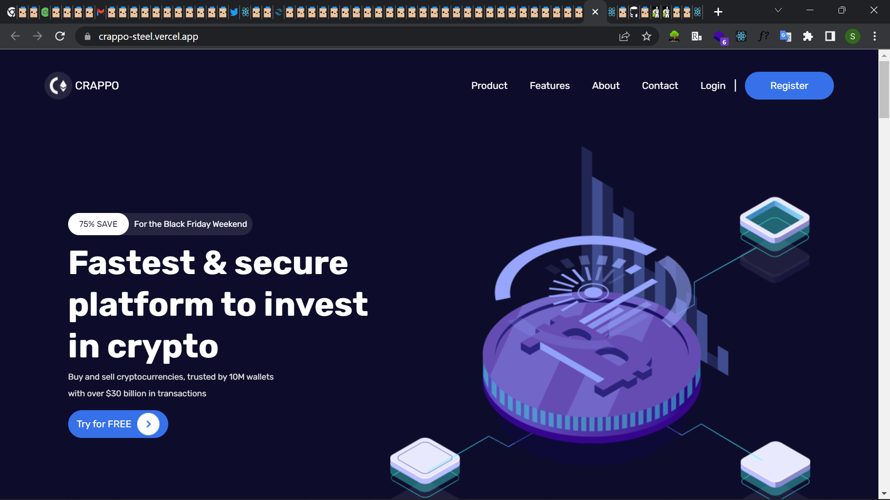

# Crappo

This is a blockchain solution landing page built using reactjs and tailwind css. I also used gsap for light animations.

## Overview

This is a crypto platform landing page built using react.js and tailwind css.

### Screenshot

### Links

- Solution URL: (https://github.com/Generalsoi/crappo)
- Live Site URL: (https://crappo-steel.vercel.app/)

## My process

### Built with

- Tailwind CSS
- [React](https://reactjs.org/) - JS library
- Greensock GSAP library

### What I learned

I learned about how to properly use tailwindCSS to style elements in react.js. I also learned how to use the GSAP library in animating elements in my web pages

### Useful resources

- [Greensock GSAP cheatsheet](https://greensock.com/cheatsheet/) - This helped me with animating the web page.
- [Tailwind CSS docs](https://tailwindcss.com/docs/installation) - The tailwind CSS documentation which helped me navigate using tailwind throughout the project phase

## Author

- Website - [Success Ikhinobele](https://www.github.com/Generalsoi)
- Twitter - [@Successsoi1](https://www.twitter.com/Successsoi1)
